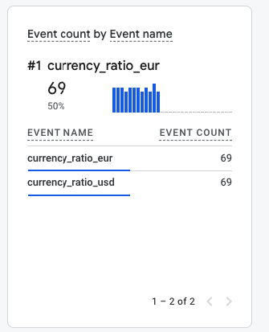

# Currencies Ratio Worker

This project is a Node.js worker that fetches currency exchange rates (USD to UAH, EUR to UAH ) from the National Bank of Ukraine's API and sends the data to Google Analytics using the Measurement Protocol.

## Features

- Fetches real-time currency exchange rates.
- Sends the exchange rate data to Google Analytics as custom events.
- Designed to run at regular intervals using a cron job.

## Setup and Installation

### Prerequisites

- [Node.js](https://nodejs.org/) (v14 or higher)
- A [Google Analytics](https://analytics.google.com/) property with a Measurement ID and API Secret.

### Instalation 
1. Clone the repository: 
```bash
git clone https://github.com/yourusername/GAMP_Currencies_Worker.git
```
2. Install the dependencies: 
```bash
npm install
```
3. Update config/gamp.js config file with your secret and measurement id

### Running worker 
```bash
node index.js
```

### Example of events tracking on GA 




